# n8n Patch Test Workflow

Isolated staging evaluation for Task #5290, covering clean n8n baseline
validation, workflow/webhook regression testing, persistence testing, and
a read-only compatibility assessment of the MatrixForgeLabs
n8n-dev-license-bypass patch.

## Outcome

The clean n8n 2.36.7 environment passed all completed functional and
persistence tests. Static analysis confirmed that the supplied patch
documents compatibility with n8n v1.119.0 only. Compatibility with the
validated n8n 2.36.7 baseline is not established, so the patch was not
applied or executed against the staging environment.

## Patch Assessment

| Item | Value |
|---|---|
| Reviewed repo | MatrixForgeLabs/n8n-dev-license-bypass |
| Reviewed commit | 4e69096875a618d894a11b995c5658214f400e68 |
| Patch SHA-256 | d2f4fd8cb4b0cfaeed6dc7fb1e5e65885b96ce549993d48dcfe7566ecf634d6b |
| Documented compatible target | n8n v1.119.0 |
| Validated staging baseline | n8n v2.36.7 |
| Review method | Read-only static analysis (clone + grep) |

### Version Compatibility

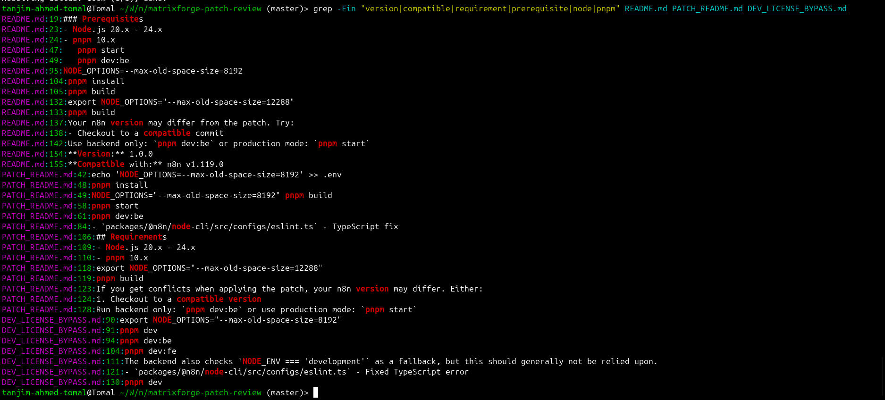

### Modified Components

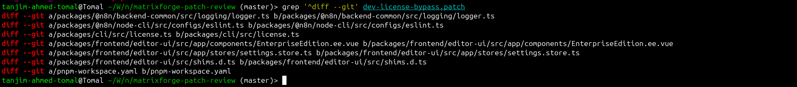

### Security and Stability Findings

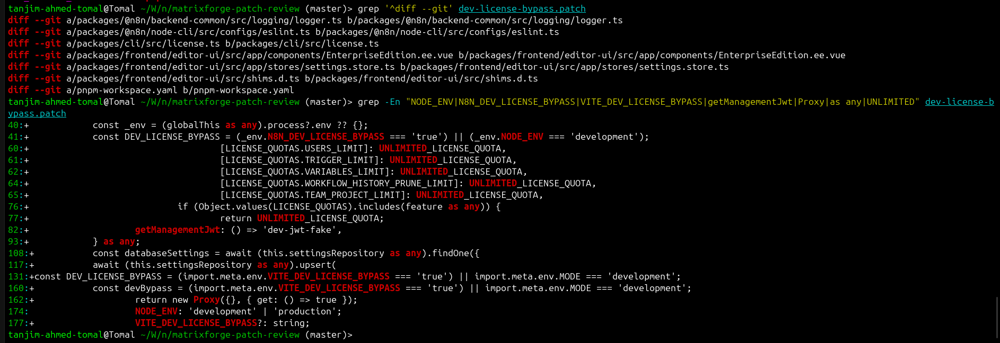

## Environment

| Component | Configuration |
|---|---|
| Host | Ubuntu |
| Runtime | Docker |
| Deployment | Docker Compose |
| n8n | 2.36.7 |
| Database | PostgreSQL 16 Alpine |
| Production impact | None |

## Baseline Validation

### Isolated Deployment
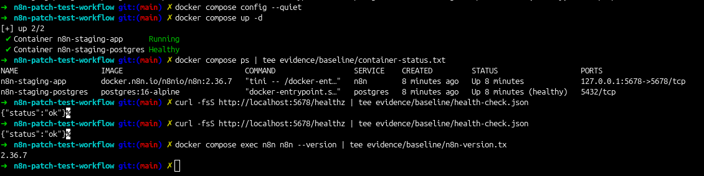

### Clean Dashboard
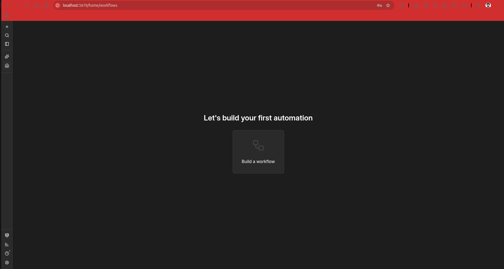

### Community Edition Baseline
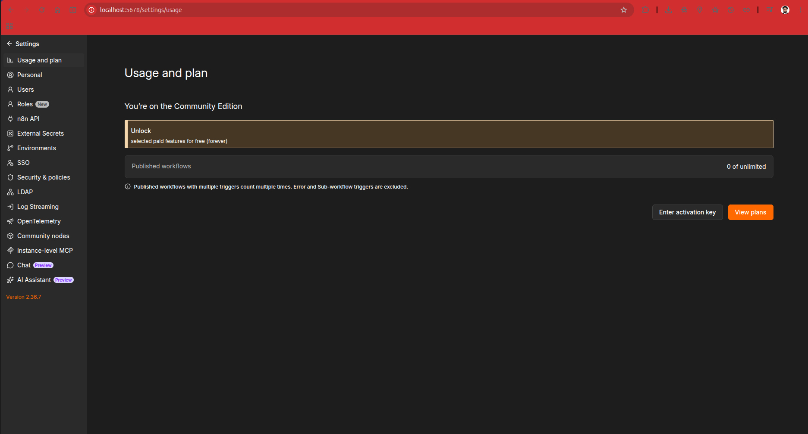

## Functional Tests

### Core Workflow
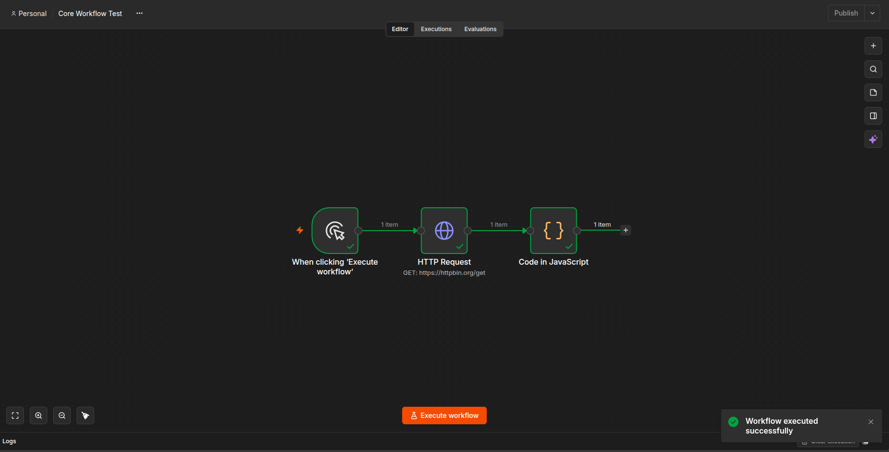

### Webhook Processing
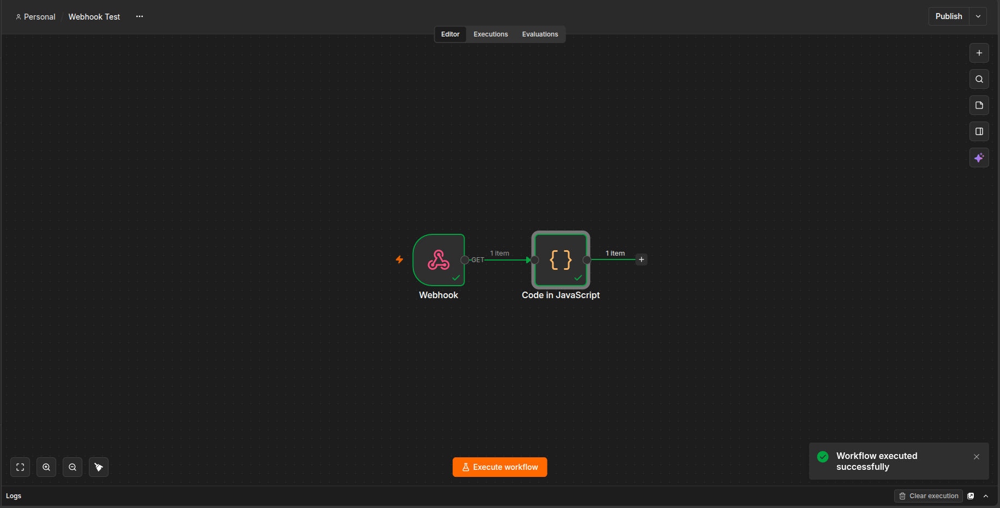

### Credential Storage
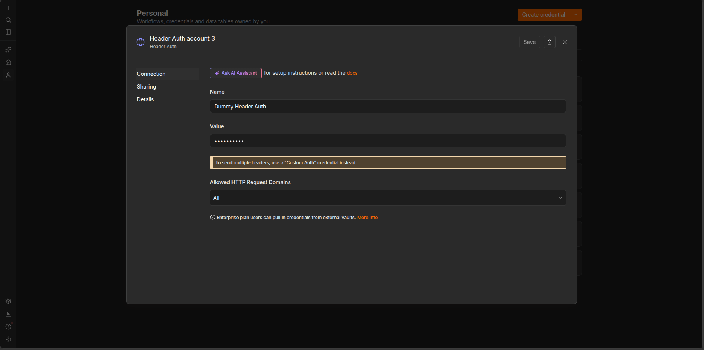

## Lifecycle & Persistence Testing

### Container Recreation
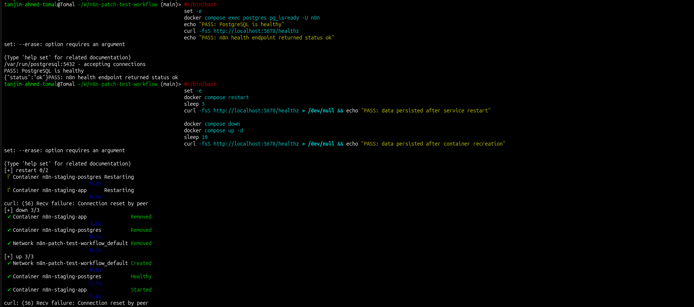

### Upgrade and Persistence
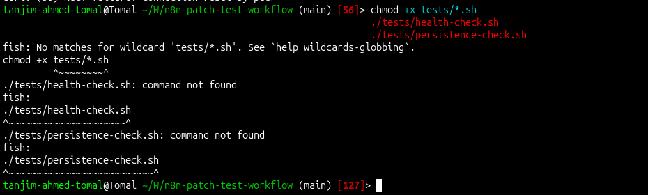

## Assessment Status

| Area | Result |
|---|---|
| Isolated Docker deployment | Passed |
| Core workflow execution | Passed |
| Webhook processing | Passed |
| Credential storage | Passed |
| Restart persistence | Passed |
| Container recreation persistence | Passed |
| Patch compatibility assessment | Completed |
| Patch execution | Not performed (blocked, version mismatch) |
| Enterprise-feature validation | Not verified |

## Deliverables

- compose.yaml — isolated Docker deployment
- tests/health-check.sh — automated health validation
- tests/persistence-check.sh — restart and recreation validation
- workflows/baseline-workflows.json — reusable test workflows
- patch-review/static-analysis.md — detailed patch findings
- reports/EVALUATION-REPORT.md — full evaluation report
- evidence/ — supporting technical evidence

## Run

Start and verify the environment:

```bash
docker compose config --quiet
docker compose up -d
docker compose ps
curl -fsS http://localhost:5678/healthz
```

Run the automated checks:

```bash
./tests/health-check.sh
./tests/persistence-check.sh
```

## Conclusion

The isolated n8n 2.36.7 baseline passed all completed health, workflow,
webhook, credential-storage, and persistence tests. The supplied patch
documents compatibility with n8n v1.119.0 only and was not applied to
the validated v2.36.7 baseline due to the version gap and associated
security/stability risks.
